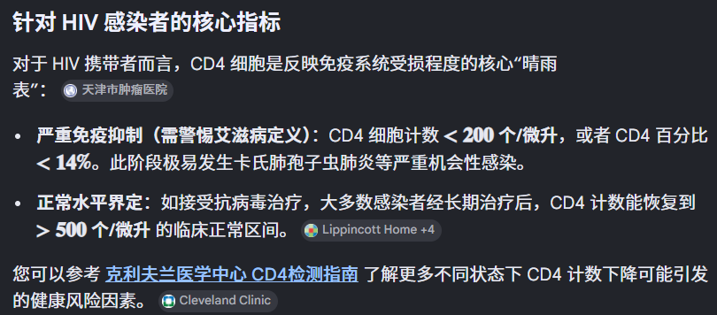

# Symptom-Graph 项目学习计划与面试准备

本文档用于从整体上理解 Symptom-Graph 项目，并围绕简历展示和面试表达进行准备。

## 1. 项目一句话定位

Symptom-Graph 是一个面向研究资料沉淀的中文互联网截图语料采集与索引系统。

推荐表达：

```text
基于 Spring Boot 的多模态截图语料采集系统，支持图片去重、私有 OSS 存储、多模型 Provider 切换、结构化入库、Obsidian Markdown 输出和 Web 页面展示。
```

## 2. 项目解决的问题

项目主要解决以下问题：

- 中文互联网截图内容容易散落，难以长期整理。
- 研究资料需要保留原始评论、上下文和原图证据链。
- 非结构化截图需要转成结构化语料，方便检索和后续写作。
- 模型输出需要受到约束，避免总结、改写、推测和编造。
- 同一份资料需要同时服务数据库查询和 Obsidian 笔记沉淀。

项目的核心价值不是“模型分析观点”，而是“把截图中的可见文字安全、稳定、可追溯地沉淀下来”。

## 3. 当前项目状态

根据 `SYMPTOM_GRAPH_PLAN.md`，当前项目已经完成 MVP 主链路，并推进到 Milestone 9：OpenRouter 多模态 Provider 接入。

已完成能力：

- Spring Boot 3.x 工程初始化。
- MySQL 表、实体、Mapper、Service。
- 阿里云 OSS 私有 Bucket 上传。
- signed URL 临时图片预览。
- Gemini 多模态识别。
- OpenRouter 多模态 Provider 接入。
- 通用 `VisionRecognitionService` 和 `VisionRecognitionProvider` 抽象。
- 图片 SHA-256 去重。
- `force=true` 强制重新识别。
- MySQL 入库。
- Obsidian Markdown 输出。
- Thymeleaf 上传页和结果页。
- 查询详情、按采集批次查询、图片临时访问链接 API。

暂时未重点完成：

- 20 张中文平台截图测试。
- 完整成功样例和失败样例整理。

当前学习重点应放在项目理解、架构讲解、设计取舍和面试表达上。

## 4. 核心链路

项目主链路如下：

```text
上传截图
-> 读取图片字节
-> 计算 SHA-256 image_hash
-> 根据 image_hash 查询是否重复
-> 非重复时上传 OSS 私有 Bucket
-> 调用 Gemini / OpenRouter 多模态 Provider
-> 解析平台、上下文、评论数组和标签
-> 多条语料写入 MySQL
-> 为每条评论生成一个 Obsidian Markdown 文件
-> Thymeleaf 页面展示识别结果与 signed URL 图片预览
```

重复图片默认逻辑：

```text
同一 image_hash 已存在，force=false
-> 不上传 OSS
-> 不调用模型
-> 直接返回历史记录
```

强制重新识别逻辑：

```text
同一 image_hash 已存在，force=true
-> 复用已有 OSS 对象
-> 重新调用多模态模型
-> 只有识别成功后才删除旧记录
-> 按稳定文件名覆盖 Markdown
-> 如果识别失败，保留历史记录
```

这条链路是项目面试讲解的主线。

## 5. 模块职责

重点理解以下模块和类：

| 模块 | 关键类 | 职责 |
| --- | --- | --- |
| API 上传入口 | `CorpusUploadController` | 提供 `/api/v1/corpus/upload` 上传接口 |
| 查询 API | `CorpusQueryController` | 查询详情、按采集批次查询、获取 signed URL |
| Web 页面 | `CorpusPageController` | 提供 Thymeleaf 上传和结果展示页面 |
| 核心编排 | `CorpusIngestionServiceImpl` | 串联校验、hash、去重、OSS、模型、入库、Markdown 输出 |
| 语料存储 | `CorpusRecordServiceImpl` | 封装 `corpus_record` 查询和写入 |
| OSS 存储 | `AliyunOssStorageServiceImpl` | 上传图片、生成 signed URL |
| 模型路由 | `ConfiguredVisionRecognitionService` | 根据配置选择 Gemini 或 OpenRouter Provider |
| 模型 Provider | `GeminiVisionServiceImpl` / `OpenRouterVisionRecognitionServiceImpl` | 调用具体多模态模型 API |
| JSON 解析 | `VisionRecognitionJsonParser` | 清理并解析模型返回 JSON |
| Prompt | `VisionRecognitionPrompt` | 统一模型提取约束 |
| Markdown 输出 | `MarkdownExportServiceImpl` | 为每条语料生成 Obsidian Markdown |

项目整体调用关系：

```text
Controller
-> CorpusIngestionService
-> CorpusRecordService
-> OssStorageService
-> VisionRecognitionService
-> MarkdownExportService
```

模型调用关系：

```text
CorpusIngestionService
-> VisionRecognitionService
-> ConfiguredVisionRecognitionService
-> GeminiVisionServiceImpl / OpenRouterVisionRecognitionServiceImpl
```

## 6. 学习计划：业务定位

学习目标：

- 能解释项目为什么存在。
- 能说明它与普通 CRUD、普通 AI Demo、普通文件上传系统的区别。
- 能用 1 分钟讲清楚项目背景、用户场景和核心价值。

需要掌握：

- 研究资料沉淀场景。
- 原文优先原则。
- 证据链设计。
- MySQL 和 Obsidian 的不同作用。
- 为什么项目不做舆情判断和意识形态解释。

面试准备问题：

- 这个项目解决什么问题？
- 为什么不直接把截图存在本地文件夹？
- 为什么不让模型直接总结截图？
- 这个项目和普通 OCR 项目有什么区别？

推荐回答方向：

```text
这个项目的目标不是让模型替我判断内容，而是把截图中的可见评论转成可追溯、可检索、可长期整理的语料。系统强调原文、上下文和证据链，因此会保存原图 OSS object key、图片 hash、模型原始返回和 Markdown 文件路径。
```

## 7. 学习计划：Spring Boot 分层架构

学习目标：

- 能解释 Controller、Service、Mapper、DTO、Entity 的职责。
- 能说明为什么核心逻辑集中在 `CorpusIngestionServiceImpl`。
- 能画出项目主调用链。

需要掌握：

- `@RestController` 和 Thymeleaf Controller 的区别。
- Service 编排层和底层能力服务的区别。
- DTO 与 Entity 的区别。
- MyBatis-Plus Service 的基本用法。

面试准备问题：

- 为什么不把上传、识别、入库逻辑写在 Controller？
- `CorpusIngestionServiceImpl` 的职责是什么？
- 如果后续增加批量上传，应该改哪个层？

推荐回答方向：

```text
Controller 只负责接收请求和返回响应，核心业务链路由 CorpusIngestionService 编排。OSS、模型识别、Markdown 输出都是独立服务，这样后续增加页面入口、批量上传或更换模型时，不需要重写主业务流程。
```

## 8. 学习计划：核心采集编排

学习目标：

- 深入理解 `CorpusIngestionServiceImpl`。
- 能完整讲出上传截图后的每一步。
- 能解释 `force=true` 的数据保护逻辑。

需要掌握：

- 文件非空校验。
- `MultipartFile` 读取字节。
- SHA-256 图片 hash。
- 根据 `image_hash` 去重。
- 新图片上传 OSS。
- 重复图片复用已有 OSS 对象。
- 调用 `VisionRecognitionService`。
- 一张截图生成多条 `CorpusRecord`。
- 成功记录才生成 Markdown。
- 重新识别失败时保留历史数据。

面试准备问题：

- 为什么先计算 hash 再上传 OSS？
- 去重能节省哪些成本？
- `force=true` 为什么不直接删除旧记录？
- 一张截图多条评论怎么处理？
- 模型识别结果为空怎么办？

推荐回答方向：

```text
去重逻辑放在 OSS 上传和模型调用之前，可以避免重复存储和重复消耗模型费用。force=true 重新识别时，系统会先拿到新识别结果，只有全部成功才替换旧记录，避免模型失败导致历史语料丢失。
```

## 9. 学习计划：数据库设计

学习目标：

- 理解 `corpus_record` 表的字段含义。
- 能解释为什么 MVP 阶段使用单表。
- 能说明索引和唯一约束的作用。

核心字段：

| 字段 | 作用 |
| --- | --- |
| `id` | 主键 |
| `capture_id` | 一次截图采集批次 |
| `comment_index` | 同一截图中的第几条评论 |
| `raw_content` | 截图中可见评论原文 |
| `context_target` | 截图中可见上下文原文 |
| `platform` | 来源平台 |
| `original_publish_time` | 原评论发布时间，可为空 |
| `collected_time` | 系统采集时间 |
| `oss_bucket` | OSS Bucket 名称 |
| `oss_object_key` | OSS Object Key |
| `image_hash` | 图片 SHA-256 |
| `tags` | JSON 标签数组，数据库中不带 `#` |
| `model_raw_response` | 模型原始返回 |
| `parse_status` | 识别状态 |
| `error_message` | 错误信息 |
| `markdown_path` | Markdown 文件路径 |

关键索引和约束：

- `idx_image_hash`：支持根据图片 hash 快速去重。
- `idx_capture_id`：支持按采集批次查询同一张截图下的多条评论。
- `uk_capture_comment`：保证同一采集批次下评论序号不重复。

面试准备问题：

- 为什么 MVP 使用单表？
- 如果项目扩大，如何拆表？
- `tags` 为什么用 JSON？
- 为什么要保存 `model_raw_response`？

推荐回答方向：

```text
MVP 阶段业务重心是语料记录，一张截图虽然对应多条评论，但主要查询对象仍然是 corpus_record，所以先用单表降低复杂度。后续如果需要管理采集任务、批量上传、失败重试和人工校对，可以再拆出 capture_record。
```

## 10. 学习计划：OSS 私有存储与 signed URL

学习目标：

- 理解为什么使用私有 Bucket。
- 理解 signed URL 的作用。
- 理解为什么 Markdown 不保存 signed URL。

需要掌握：

- OSS Bucket 使用私有读写。
- 数据库保存 `oss_bucket` 和 `oss_object_key`。
- 页面展示时临时生成 signed URL。
- Markdown 只保存 `image_hash` 和 `oss_object_key`。
- Object Key 按日期、采集批次和 UUID 组织。

面试准备问题：

- 为什么不用公开 Bucket？
- signed URL 解决什么问题？
- URL 过期后怎么办？
- 为什么 Markdown 不保存 signed URL？

推荐回答方向：

```text
截图属于原始资料，不适合公开暴露，所以 OSS 使用私有 Bucket。数据库长期保存 object key，页面访问时由后端生成短期 signed URL。Markdown 是长期研究资料，不能写入会过期的 signed URL，因此只保存 image_hash 和 oss_object_key 作为证据链。
```

## 11. 学习计划：多模态 Provider 抽象

学习目标：

- 理解项目如何从 Gemini 扩展到 OpenRouter。
- 能解释 Provider 抽象的价值。
- 能说明如何继续接入新的模型厂商。

核心接口：

- `VisionRecognitionService`：业务层统一识别入口。
- `VisionRecognitionProvider`：具体模型 Provider 接口。
- `ConfiguredVisionRecognitionService`：根据 `app.vision.provider` 路由到具体 Provider。
- `GeminiVisionServiceImpl`：Gemini 实现。
- `OpenRouterVisionRecognitionServiceImpl`：OpenRouter 实现。

设计价值：

- 核心采集链路不绑定某个模型厂商。
- 可以通过配置切换 `gemini` 或 `openrouter`。
- Prompt 和 JSON 解析逻辑可以复用。
- 后续接入其他多模态模型时，只需要新增 Provider。

面试准备问题：

- 为什么不直接在 `CorpusIngestionServiceImpl` 调 Gemini？
- 如果接入阿里百炼或火山模型，怎么做？
- Gemini 和 OpenRouter 响应格式不同怎么办？
- text-only 模型为什么不能处理截图？

推荐回答方向：

```text
多模态模型的价格、可用性和响应格式都会变化，所以业务链路不能绑定某个模型厂商。我抽象了 VisionRecognitionProvider，核心服务只依赖统一的 VisionRecognitionService。新增模型时只需要实现 Provider，并复用统一 Prompt 和 JSON 解析逻辑。
```

## 12. 学习计划：Prompt 约束与模型风险控制

学习目标：

- 理解本项目中模型的角色。
- 能解释如何降低模型幻觉对数据的影响。
- 能说明为什么保存模型原始返回。

Prompt 关键约束：

- 只能提取截图中实际可见文字。
- 不得推测。
- 不得总结。
- 不得改写。
- 不得补全。
- `context_target` 必须来自截图可见文字。
- `raw_content` 必须来自截图可见评论。
- 无法识别时返回 `null` 或空数组。
- tags 不带 `#`。
- tags 必须是现象性标签，不能对发言者做心理诊断或人格判断。

面试准备问题：

- 如何避免模型编造？
- 如果模型返回 Markdown 包裹 JSON 怎么办？
- 如果模型返回非法 JSON 怎么办？
- 为什么要保存 `model_raw_response`？

推荐回答方向：

```text
我没有把模型输出直接当成绝对事实，而是通过严格 Prompt 限制模型只能提取可见文字，并保存 model_raw_response 方便追溯。同时通过 parse_status 区分成功、模型失败、JSON 解析失败和空结果，避免失败数据被当成正常语料。
```

## 13. 学习计划：Markdown 与 Obsidian 输出

学习目标：

- 理解为什么同时写 MySQL 和 Markdown。
- 掌握 Markdown 文件结构。
- 能解释 tags 在数据库和 Obsidian 中的差异。

输出规则：

- 输出目录默认为 `obsidian-output/`。
- 一条评论生成一个 Markdown 文件。
- 文件名规则：`{capture_id}-{comment_index}-{platform}.md`。
- Front Matter 保存结构化元数据。
- 正文保存原始评论、上下文原文、证据链和研究备注。
- 数据库 tags 不带 `#`。
- Markdown 额外输出 Obsidian tags，带 `#`。
- Markdown 不嵌入 signed URL。

面试准备问题：

- 为什么既需要 MySQL 又需要 Markdown？
- 为什么一条评论一个 Markdown？
- 为什么 Markdown 不保存图片访问 URL？
- 文件名非法字符如何处理？

推荐回答方向：

```text
MySQL 适合结构化查询和接口返回，Obsidian Markdown 适合长期阅读、链接和写作整理。两者服务不同场景，所以系统同时输出结构化数据库记录和面向研究沉淀的 Markdown 文件。
```

## 14. 学习计划：Web 页面与 API

学习目标：

- 能演示页面上传截图。
- 能说明 API 设计。
- 能解释页面和 API 如何复用核心服务。

核心接口：

```http
POST /api/v1/corpus/upload
```

```http
GET /api/v1/corpus/{id}
```

```http
GET /api/v1/corpus/captures/{captureId}
```

```http
GET /api/v1/corpus/{id}/image-url
```

页面入口：

```text
http://localhost:8080/corpus/upload
```

学习重点：

- 上传页支持文件选择。
- 支持 `force=true`。
- 展示重复图片提示。
- 展示 signed URL 图片预览。
- 展示平台、上下文、评论、tags、Markdown 路径。
- API 和页面入口都复用 `CorpusIngestionService`。

面试准备问题：

- 页面和 API 为什么不各写一套逻辑？
- signed URL 是在哪里生成的？
- 查询接口为什么按 `id` 和 `captureId` 都提供？

## 15. 学习计划：异常状态与边界处理

学习目标：

- 能说明项目如何处理模型失败和解析失败。
- 能解释 `parse_status` 的价值。
- 能讨论当前边界和后续改进方向。

核心状态：

| 状态 | 含义 |
| --- | --- |
| `SUCCESS` | 识别成功并生成正常语料 |
| `MODEL_FAILED` | 模型调用失败或 Provider 配置异常 |
| `PARSE_FAILED` | 模型返回内容无法解析为合法 JSON |
| `EMPTY_RESULT` | 模型调用成功，但未识别到可见评论 |

面试准备问题：

- 模型 API 调用失败怎么办？
- 模型返回非法 JSON 怎么办？
- 模型识别不到评论怎么办？
- `force=true` 重新识别失败时如何保护历史数据？
- Markdown 写入失败是否会影响事务？

推荐回答方向：

```text
系统不会把所有失败都简单吞掉，而是通过 parse_status 和 error_message 记录失败类型。对于 force=true，只有新识别结果成功时才替换旧数据，否则返回失败结果但保留历史记录，避免重新识别破坏已有语料。
```

## 16. 简历写法

推荐项目描述：

```text
Symptom-Graph：基于 Spring Boot 的中文互联网截图语料采集与索引系统，支持截图上传、图片去重、私有 OSS 存储、多模态模型识别、MySQL 入库、Obsidian Markdown 输出和 Web 页面展示。
```

推荐职责描述：

- 基于 Spring Boot 3 + MyBatis-Plus 实现截图语料采集系统，支持截图上传、SHA-256 去重、多评论解析和结构化入库。
- 集成阿里云 OSS 私有 Bucket，使用 object key 持久化原图证据链，并通过 signed URL 实现临时安全预览。
- 抽象 `VisionRecognitionService` / `VisionRecognitionProvider`，支持 Gemini 与 OpenRouter 多模态模型按配置切换，降低业务链路对单一模型厂商的耦合。
- 设计严格 Prompt 与 JSON 解析流程，约束模型只提取截图可见文字，并通过 `parse_status`、`model_raw_response` 记录失败和原始响应。
- 实现 Obsidian Markdown 导出能力，为每条评论生成独立笔记文件，同时保留 tags、`image_hash`、`oss_object_key` 等元数据。

## 17. 面试讲解顺序

推荐讲解顺序：

1. 先讲业务问题：截图资料难整理，需要可追溯语料库。
2. 再讲主链路：上传、hash、OSS、模型、MySQL、Markdown、页面展示。
3. 然后讲核心设计：去重、`force=true`、Provider 抽象、证据链。
4. 最后讲工程取舍：MVP 单表、私有 OSS、signed URL、Markdown 不存 URL、模型失败状态。

1 分钟版本：

```text
这个项目是一个中文互联网截图语料采集系统。我用 Spring Boot 实现截图上传后端，先计算 SHA-256 做图片去重，非重复图片上传到阿里云 OSS 私有 Bucket，再调用 Gemini 或 OpenRouter 多模态模型提取截图中的可见评论。识别结果会按一张截图多条评论写入 MySQL，同时为每条评论生成 Obsidian Markdown。系统保留 image_hash、oss_object_key、model_raw_response 等证据链字段，并通过 signed URL 在页面临时预览原图。架构上我抽象了 VisionRecognitionProvider，让核心采集链路不绑定某个模型厂商。
```

## 18. 高频面试问题清单

建议优先准备以下问题：

- 这个项目解决什么实际问题？
- 为什么要做图片 hash 去重？
- 为什么使用 SHA-256？
- 为什么使用私有 OSS Bucket？
- signed URL 的作用是什么？
- 为什么 Markdown 不保存 signed URL？
- 为什么要同时写 MySQL 和 Markdown？
- 一张截图多条评论如何建模？
- 为什么 MVP 使用单表？
- 后续如何拆分 `capture_record` 和 `corpus_record`？
- 为什么抽象 `VisionRecognitionProvider`？
- 如何新增一个模型 Provider？
- 如何控制模型不要编造？
- 模型返回非法 JSON 怎么办？
- 模型识别为空怎么办？
- `force=true` 如何避免破坏历史数据？
- 如果 OSS 上传成功但模型失败怎么办？
- 如果 Markdown 写入失败怎么办？
- 这个项目目前最大的不足是什么？
- 后续如果继续扩展，你会优先做什么？

## 19. 后续扩展方向

如果后续继续做功能，不建议盲目堆大而全功能，应围绕当前主链路增强。

优先级较高的扩展：

- 补齐 20 张真实截图测试。
- 整理成功样例和失败样例。
- 增加采集结果列表页。
- 支持按平台、标签、时间查询。
- 增加人工校对 `raw_content`、`context_target` 和 `tags` 的能力。
- 支持批量上传。
- 支持重新生成 Markdown。
- 增加失败重试机制。

不建议当前阶段优先做：

- 用户登录系统。
- 多租户工作空间。
- 大型后台管理系统。
- 舆情统计看板。
- 自动爬虫采集。
- 向量检索。

原因是这些功能会扩大项目边界，反而削弱 MVP 主链路的清晰度。

## 20. 复习优先级

第一优先级：

- 项目定位。
- 核心采集链路。
- `CorpusIngestionServiceImpl`。
- 图片去重和 `force=true`。
- OSS 私有存储和 signed URL。
- Provider 抽象。

第二优先级：

- 数据库字段设计。
- Markdown 输出规则。
- Prompt 约束。
- `parse_status` 异常状态。
- API 和页面入口。

第三优先级：

- 自动化测试覆盖。
- 真实截图测试报告。
- 后续扩展功能设计。
- 性能、事务和失败恢复细节。

## 21. 最终准备目标

完成本学习计划后，应达到以下目标：

- 能在 1 分钟内讲清楚项目价值。
- 能在 3 到 5 分钟内讲清楚完整技术链路。
- 能解释每个核心模块的职责。
- 能回答为什么这么设计，而不是只背代码。
- 能说清楚当前项目边界和后续演进方向。
- 能把项目包装成一个有业务场景、有工程设计、有取舍意识的 Java 后端简历项目。
